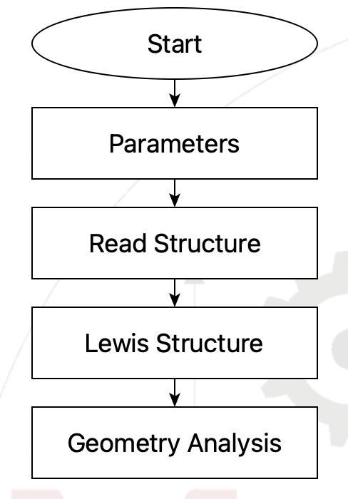

***************
Getting Started
***************

Installation
============
The Geometry Analysis step is probably already installed in your SEAMM environment, but
if not or if you wish to check, follow the directions for the `SEAMM Installer`_. The
graphical installer is the easiest to use. In the SEAMM conda environment, simply type::

  seamm-installer

or use the shortcut if you installed one. Switch to the second tab, `Components`, and
check for `geometry-analysis-step`. If it is not installed, or can be updated, check the box
next to it and click `Install selected` or `Update selected` as appropriate.

The non-graphical installer is also straightforward::

  seamm-installer install --update geometry-analysis-step

will ensure both that it is installed and up-to-date.

.. _SEAMM Installer: https://molssi-seamm.github.io/installation/index.html

Examining a structure
=====================
This simple flowchart :download:`download <./geometry.flow>`

   Flowchart for simple geometry analysis

will read a molecular structure file, add bonds using the MOPAC functionality for
generating the Lewis structure, then print information about the bonds, angles, etc.

Runing the flowchart on a structure of water -- :download:`the XYZ file <./h2o.xyz>`
from the DFTB+ distribution in this example -- yields the following output::

  Step 4: Geometry Analysis  2022.12.24
    Tabulate the bond lengths, angles, dihedral angles, and Wilson out-of-plane
    angles for the system.

    Number of atoms: 3

               Bonds            
    +-------+------+-----------+
    | Atoms | Bond | Value (Å) |
    +-------+------+-----------+
    |  2-1  | H-O  |    0.9672 |
    |  3-1  | H-O  |    0.9672 |
    +-------+------+-----------+

                Angles           
    +-------+-------+-----------+
    | Atoms | Angle | Value (º) |
    +-------+-------+-----------+
    | 3-1-2 | H-O-H |    107.19 |
    +-------+-------+-----------+

    There are no dihedrals in this system.

    There are no out-of-planes in this system.

A slightly more complex example, :download:`1,2-butadiene <1,2-butadiene.mop>`
H2C=C=CH-CH3 from MOPAC::

  Step 4: Geometry Analysis  2022.12.24
    Tabulate the bond lengths, angles, dihedral angles, and Wilson out-of-plane
    angles for the system.

    Number of atoms: 10

               Bonds            
    +-------+------+-----------+
    | Atoms | Bond | Value (Å) |
    +-------+------+-----------+
    |  2-1  | C=C  |    1.3008 |
    |  3-2  | C=C  |    1.3059 |
    |  4-8  | C-H  |    1.0985 |
    |  1-5  | C-H  |    1.0817 |
    |  4-3  | C-C  |    1.4905 |
    |  4-9  | C-H  |    1.1002 |
    |  1-6  | C-H  |    1.0817 |
    |  3-7  | C-H  |    1.0914 |
    | 4-10  | C-H  |    1.1002 |
    +-------+------+-----------+

                Angles            
    +--------+-------+-----------+
    | Atoms  | Angle | Value (º) |
    +--------+-------+-----------+
    | 2-1-5  | C=C-H |    123.58 |
    | 2-1-6  | C=C-H |    123.58 |
    | 6-1-5  | H-C-H |    112.84 |
    | 3-2-1  | C=C=C |    180.00 |
    | 4-3-2  | C-C=C |    122.84 |
    | 2-3-7  | C=C-H |    121.43 |
    | 4-3-7  | C-C-H |    115.73 |
    | 3-4-8  | C-C-H |    112.69 |
    | 3-4-9  | C-C-H |    110.94 |
    | 3-4-10 | C-C-H |    110.94 |
    | 9-4-8  | H-C-H |    107.31 |
    | 10-4-8 | H-C-H |    107.31 |
    | 10-4-9 | H-C-H |    107.41 |
    +--------+-------+-----------+

                         Dihedral Angles                     
    +----------+----------+-----------+---------------------+
    |  Atoms   | Dihedral | Value (º) | Description         |
    +----------+----------+-----------+---------------------+
    | 3-2-1-5  | C=C=C-H  |      0.00 | C  = synperiplaner  |
    | 3-2-1-6  | C=C=C-H  |      0.00 | C  = synperiplaner  |
    | 4-3-2-1  | C-C=C=C  |      0.00 | C  = synperiplaner  |
    | 1-2-3-7  | C=C=C-H  |      0.00 | C  = synperiplaner  |
    | 2-3-4-8  | C=C-C-H  |      0.00 | C  = synperiplaner  |
    | 2-3-4-9  | C=C-C-H  |    120.35 | A+ = +anticlinal    |
    | 2-3-4-10 | C=C-C-H  |   -120.35 | G- = -synclinal     |
    | 8-4-3-7  | H-C-C-H  |    180.00 | T  = antiperiplaner |
    | 9-4-3-7  | H-C-C-H  |    -59.65 | G- = -synclinal     |
    | 10-4-3-7 | H-C-C-H  |     59.65 | G+ = +synclinal     |
    +----------+----------+-----------+---------------------+

             Out-of-plane Angles         
    +-----------+-----------+-----------+
    |   Atoms   |    Oop    | Value (º) |
    +-----------+-----------+-----------+
    | 2-1(-5)-6 | C=C(-H)-H |      0.00 |
    | 2-3(-4)-7 | C=C(-C)-H |      0.00 |
    +-----------+-----------+-----------+

That should be enpugh to get started. However, remember that this functionality depends
on having bonds in the structure, so you either need to use file formats that support
bond information, start from SMILES, or, as we did here, use one of the tools in SEAMM
to create the appropriate bonding information.

For more detail about the functionality in this plug-in, see the :ref:`User Guide <user-guide>`.
